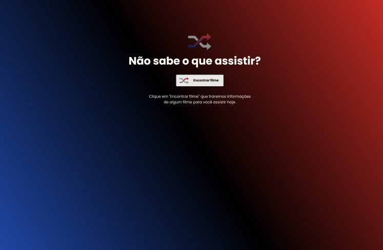
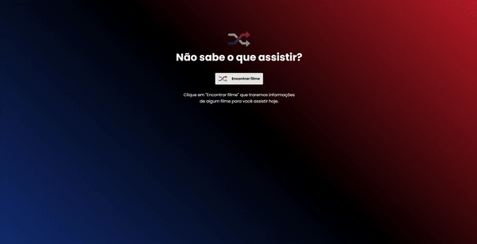

# Rocketflix

## 🎯 Desafio:

Neste desafio, foi proposto a criação de uma página que consuma a API do TMDB para sugerir um filme randômico.
 
### Layout disponibilizado:

 

## 🚀 Resultado: 

    

<a href="https://rocketflix-pi.vercel.app">Clique aqui para acessar o projeto</a> 

## ⚒️ Tecnologias utilizadas:
* JavaScript
* HTML
* CSS
